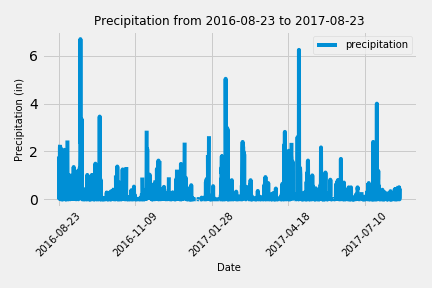

# sqlalchemy-challenge

## Exploratory Precipitation and Station Analysis

After reflecting the tables into a SQLalchemy ORM, I ran a series of queries for my preliminary precipitation and temperature analysis. 

### Last Twelve Months

The first query was to isolate the precipitation data for the last twelve months. This was performed by first identifiying the latest date in the data set and then creating a variable for that date one year ago. With that date, I ran a query to get the date and precipitation data for the past year and then transformed results into a DataFrame. Using Pandas plotting, I created a plot graph to visualize the data.

### Temperature Frequency at Most Active Station

The next query was to isolate the temperature data for the most active station over the last twelve months. This was performed by first identifiying the most active station in the data set. With the most active station, I ran a query to get the daily temperature at the station. Using Pandas plotting, I created a histogram to visualize the frequency of the different temperatures.

## Creating API through Flask

After having completed my analysis of the data, I created an API using Flask. I set up 6 routes:

    1. Home Route
    2. Precipitation Route
    3. Stations Route
    4. TOBS Route
    5. User-input Start Date Route
    6. User-input Start and End Date Route

For each route, I create a list of dictionaries to provide the data needed for the route.